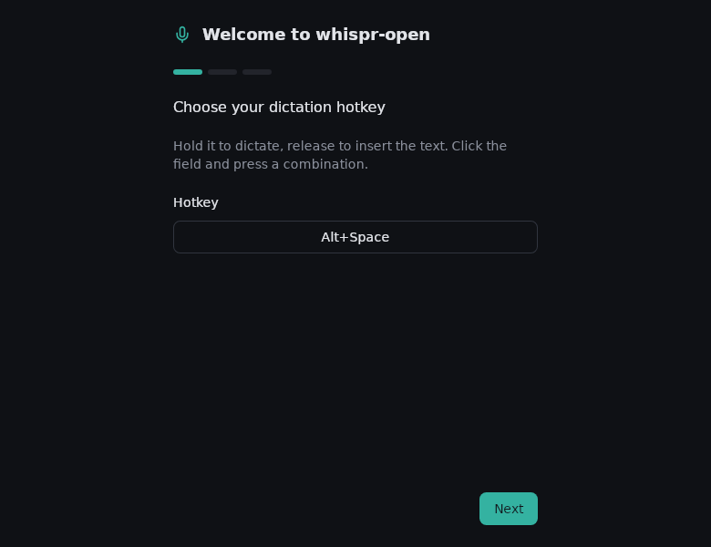

# whispr-open

[](https://github.com/kochevrin/voice-to-text/actions/workflows/release.yml)
[](LICENSE)

Open-source, cross-platform push-to-talk dictation. Hold a hotkey, speak,
release — your words are transcribed locally by [whisper.cpp](https://github.com/ggerganov/whisper.cpp)
and typed into whatever app has focus. A self-hostable replacement for Wispr
Flow: no cloud, no subscription, your audio never leaves the machine.

<p align="center">
  
</p>

## Features

- **Push-to-talk or toggle** dictation via a global hotkey (default `Alt+Space`)
- **Fully local transcription** — whisper.cpp sidecar, models from `tiny` to
  `medium`, multilingual + English-only variants, auto language detection
- **Text injection** into the focused app (unicode keystrokes; clipboard
  fallback where injection is unavailable)
- **Voice activity detection** — recording stops automatically after silence
- **Optional post-processing** through a local [Ollama](https://ollama.com)
  model (grammar/punctuation cleanup, fully configurable prompt)
- **Optional cloud transcription** via any OpenAI-compatible API (presets for
  [Groq](https://console.groq.com) — generous free tier, very fast
  `whisper-large-v3-turbo` — and OpenAI), with automatic fallback to the local
  engine; off by default
- **On-screen pill** indicator, transcription history (last 20), pause mode,
  in-app model downloads
- Linux (X11 + Wayland), macOS (universal), Windows

## Architecture

```
┌─────────────────────────────  Tauri v2 app  ─────────────────────────────┐
│                                                                          │
│  React UI (settings, onboarding,      Rust core (src-tauri)              │
│  history, pill)                       ├─ global hotkey (push-to-talk)    │
│  src/lib/tauri.ts — typed IPC   ◄──►  ├─ mic capture (cpal) + VAD        │
│  wrapper with an in-browser           ├─ text injection / clipboard      │
│  mock for dev & tests                 ├─ model download & storage        │
│                                       └─ settings persistence            │
│                                              │                           │
│                              whispr-core (pure Rust crate:               │
│                              VAD trigger, hotkey normalization,          │
│                              inject planning, settings model)            │
└──────────────────────────────────────┼───────────────────────────────────┘
                                       │ spawns per utterance
                          whisper-cli sidecar (whisper.cpp v1.7.4)
                                       │ optional HTTP
                          Ollama (post-processing, off by default)
```

The IPC surface (commands, events, settings schema) is specified in
[`docs/contracts.md`](docs/contracts.md).

## Quickstart

### Prerequisites

**Linux (Debian/Ubuntu):**

```sh
sudo apt-get install -y build-essential libwebkit2gtk-4.1-dev libgtk-3-dev \
  libasound2-dev libayatana-appindicator3-dev librsvg2-dev libxdo-dev \
  patchelf cmake
```

Plus Rust (stable), Node 22+, pnpm 11.

**macOS:** Xcode Command Line Tools (`xcode-select --install`) + `cmake`
(`brew install cmake`), Rust, Node 22+, pnpm.

**Windows:** Visual Studio Build Tools (C++ workload) + `cmake`, Rust, Node
22+, pnpm.

### Run it

```sh
git clone https://github.com/kochevrin/voice-to-text.git
cd voice-to-text
pnpm install

# Build the whisper.cpp sidecar binary for your OS (one-time; see sidecar/whisper/README.md)
bash sidecar/whisper/build-linux.sh       # Linux
bash sidecar/whisper/build-macos.sh       # macOS
./sidecar/whisper/build-windows.ps1       # Windows (PowerShell)

pnpm tauri dev
```

### First run

On first launch the onboarding flow downloads the selected whisper model
(default `base.en`, ~148 MB) from Hugging Face into the app data directory (see
below) and lets you test the microphone and hotkey. Models can be added or
removed later in Settings.

OS permissions (microphone, macOS Accessibility, Wayland ydotool setup) are
documented in [`docs/permissions.md`](docs/permissions.md).

### Cloud transcription (optional)

Settings → Transcription → **Cloud transcription**: pick a preset (Groq /
OpenAI / Custom), paste your API key, enable the switch. Recorded audio is then
uploaded to `{base_url}/audio/transcriptions` instead of running the local
model — with Groq's `whisper-large-v3-turbo` this is usually much faster than
local CPU inference, and Groq offers a free tier (get a key at
[console.groq.com](https://console.groq.com/keys)). On any network/API error
the app silently falls back to the local engine (configurable). Privacy trade-
off is surfaced in the Privacy tab: while enabled, audio leaves your device;
the API key is stored in plain text in your local `settings.json`.

## App data paths

Settings live at `<app-data>/settings.json`, models at
`<app-data>/models/ggml-<model>.bin`, where `<app-data>` is:

| OS | Path |
|---|---|
| Linux | `~/.local/share/dev.whispr.open` |
| macOS | `~/Library/Application Support/dev.whispr.open` |
| Windows | `%APPDATA%\dev.whispr.open` |

## Releases

Tagging triggers CI (`.github/workflows/release.yml`): tests run on Linux,
then macOS/Linux/Windows bundles are built and attached to a **draft** GitHub
release (dmg / msi + nsis / deb + rpm + AppImage):

```sh
git tag v0.1.0
git push --tags
```

Review and publish the draft release manually.

### macOS signing and notarization — NOT configured

Release artifacts are currently unsigned (Gatekeeper consequences in
[`docs/permissions.md`](docs/permissions.md)). To enable signing, the missing
steps are:

1. Enroll in the Apple Developer Program and create a **Developer ID
   Application** certificate; export it as a `.p12`.
2. Add repository secrets consumed by `tauri-action`:
   - `APPLE_CERTIFICATE` — base64 of the `.p12`
   - `APPLE_CERTIFICATE_PASSWORD` — its password
   - `APPLE_SIGNING_IDENTITY` — e.g. `Developer ID Application: Name (TEAMID)`
3. For notarization, create an App Store Connect **notarytool API key** and add:
   - `APPLE_API_ISSUER`, `APPLE_API_KEY`, `APPLE_API_KEY_PATH` (or
     `APPLE_ID`/`APPLE_PASSWORD`/`APPLE_TEAM_ID` for Apple-ID auth)
4. Pass these secrets as `env` on the `tauri-action` step in
   `.github/workflows/release.yml`; tauri picks them up automatically.

`src-tauri/entitlements.plist` already exists (microphone entitlement) and is
wired via `bundle.macOS.entitlements`.

## Verification in Docker

The primary dev host (WSL2) has no C toolchain/ALSA headers, so anything that
compiles C runs in the `whispr-dev` image:

```sh
docker build -t whispr-dev -f docker/dev.Dockerfile .

# Linux sidecar build (required once before workspace tests — tauri-build needs the binary)
docker run --rm -v "$PWD":/app -w /app whispr-dev bash sidecar/whisper/build-linux.sh

# Full Rust workspace tests
docker run --rm -v "$PWD":/app -w /app whispr-dev cargo test --workspace
```

## Testing

```sh
pnpm test        # frontend unit tests (vitest)
pnpm test:e2e    # Playwright e2e against the mocked Tauri backend
cargo test -p whispr-core                 # pure-Rust core tests (runs on any host)
docker run --rm -v "$PWD":/app -w /app whispr-dev bash sidecar/whisper/build-linux.sh  # once, before workspace tests
docker run --rm -v "$PWD":/app -w /app whispr-dev cargo test --workspace
```

Manual per-OS injection checklists: [`docs/testing.md`](docs/testing.md).
Known deviations from the original spec: [`docs/deviations.md`](docs/deviations.md).

## License

whispr-open is [MIT](LICENSE)-licensed.

It stands on open-source components with their own licenses — most notably
[whisper.cpp](https://github.com/ggerganov/whisper.cpp) (MIT), OpenAI's Whisper
model weights (MIT) and [Tauri](https://tauri.app) (Apache-2.0/MIT). The full
rundown of bundled third-party components is in
[`THIRD-PARTY.md`](THIRD-PARTY.md).
